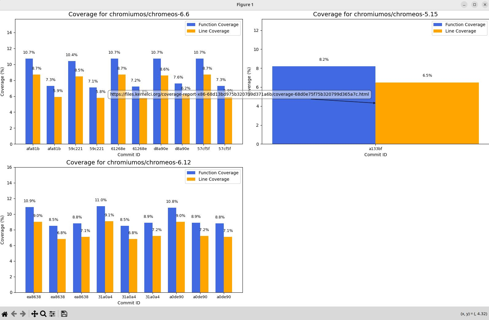

+++
title = 'maestro coverage'
date = 2025-10-15
description = 'Command to show Maestro coverage information'
+++

This command is Maestro-specific and will fetch coverage information
for ChromiumOS tree.

```sh
kci-dev maestro coverage
```

This command will show the coverage information including function coverage, line coverage, coverage report URL and coverage logs for the specific maestro build.

Sample command:
```
$ kci-dev maestro coverage
- Tree/branch: chromiumos/chromeos-6.12
  Commit: 1d022843a344dd50b57600abc3e5b3f14f8a463f
  Build: https://staging.kernelci.org:9000/viewer?node_id=68b83f8a18776824c891f55c
  Function coverage: 19.3%
  Line coverage: 15.5%
  Coverage report: https://files-staging.kernelci.org/coverage-report-x86-68bac05fa6a30c5a1ec57f88/coverage-68b83f8a18776824c891f55c.html
  Coverage logs: https://files-staging.kernelci.org/coverage-report-x86-68bac05fa6a30c5a1ec57f88/log.txt

- Tree/branch: chromiumos/chromeos-6.6
  Commit: 3a3e081223ed84b1e24cee86fb599c209ee489be
  Build: https://staging.kernelci.org:9000/viewer?node_id=68c31cbf223895c1a77c5cee
  Function coverage: 10.7%
  Line coverage: 8.7%
  Coverage report: https://files-staging.kernelci.org/coverage-report-arm64-68c350e8223895c1a77cb5fe/coverage-68c31cbf223895c1a77c5cee.html
  Coverage logs: https://files-staging.kernelci.org/coverage-report-arm64-68c350e8223895c1a77cb5fe/log.txt

- Tree/branch: chromiumos/chromeos-6.12
  Commit: 5086fc23a5a4236fc7cc06aa92329d729761465d
  Build: https://staging.kernelci.org:9000/viewer?node_id=68c31d0a223895c1a77c5d3c
  Function coverage: 11.0%
  Line coverage: 9.1%
  Coverage report: https://files-staging.kernelci.org/coverage-report-arm64-68c371969e7d6a2d0e73dc70/coverage-68c31d0a223895c1a77c5d3c.html
  Coverage logs: https://files-staging.kernelci.org/coverage-report-arm64-68c371969e7d6a2d0e73dc70/log.txt
``` 

By default the command will retrieve coverage information for the first 1000 builds. That can be changed by specifying `--limit` option.
Additionally, you can provide optional parameters such as branch, start date, end date to filter the results.
For example:
```sh
kci-dev maestro coverage --start-date 2025-09-01
```

Use `--help` option to list all the optional arguments.

You can also generate a bar graph to get coverage information visualization.
It can be retrieved by using `--graph-output` option.
For example:
```sh
kci-dev maestro coverage --start-date 2025-09-01 --graph-output
```
The command will generate a graph per branch. The bars will show function and lines coverage against different build commits. You can see the coverage report URL by hovering on the bars. Click the link to download the report or open it in your browser.

Sample output:
[](coverage-bar-graph.jpeg)
